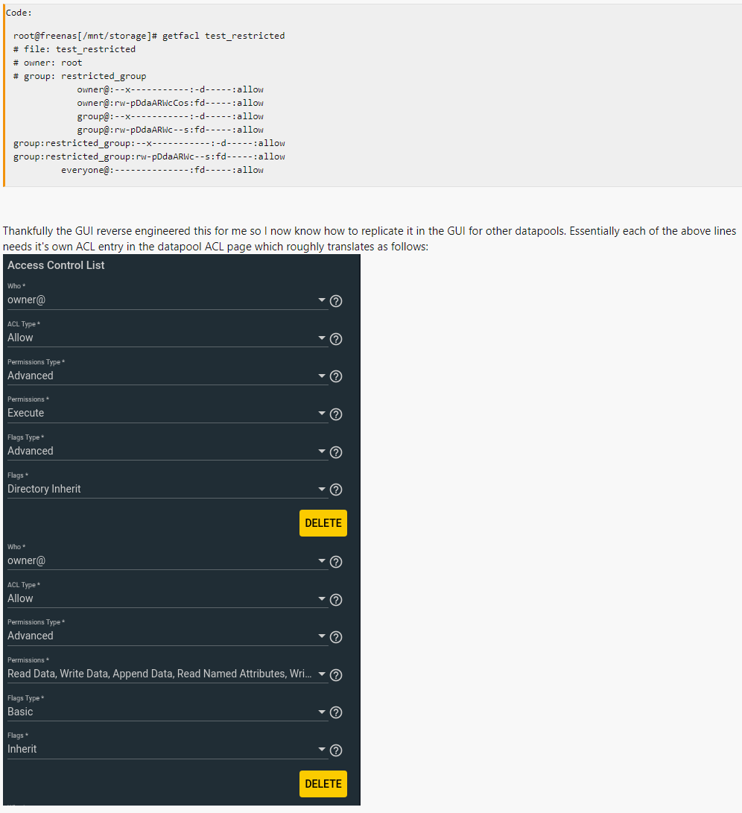

# FreeNAS/TrueNAS notes

## Setup NFS ACLs so files don't inherit the execute bit

Thank you to muppet_3000 for solving this!
https://www.truenas.com/community/threads/freenas-acls-and-a-somewhat-sticky-executable-bit.86670/



## FreeNAS 11/12 Recover from expired cert

For some reason the ACME certs in FreeNAS never renew.  If they expire, and http is disabled, you can be left without a way to login to the web UI.

The trick is to SSH on to the FreeNAS host and then use the API to disable https as the API does not redirect http to https.  Note that because HTTP is used this is not secure.

```
curl -basic -u root -k -X PUT "https://freenas.hostname.com/api/v2.0/system/general" -H "accept: */* -H "Content-Type: application/json" -d '{"ui_httpsredirect":false}'

su root
service nginx restart
```

## FreeNAS 11/12 Recover from expired cert - Alternative Method

Another method I've used is manipulating the Freenas sqlite database directly from the FreeNAS host.

You need to SSH to the FreeNAS host and then disable the http to https redirect setting.  Unfortunately, I forgot to write this down the last two times I did it, so they best I can do right now is to capture a couple standard sqlite commands.

### SQLite - Read all tables

```
sqlite3 name.db '.tables'
```

### SQLite - Read all columns

```
sqlite3 name.db 'PRAGMA table_info(table_name);'
```

Next: find the table with the HTTPS redirect setting and change it.  